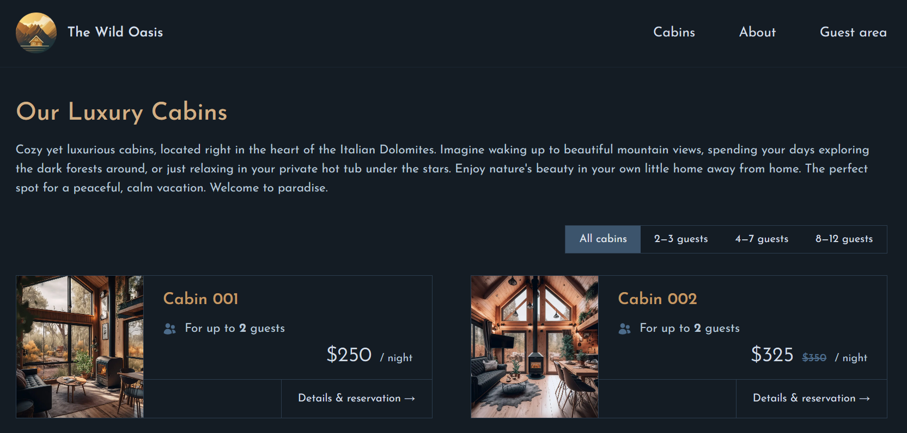
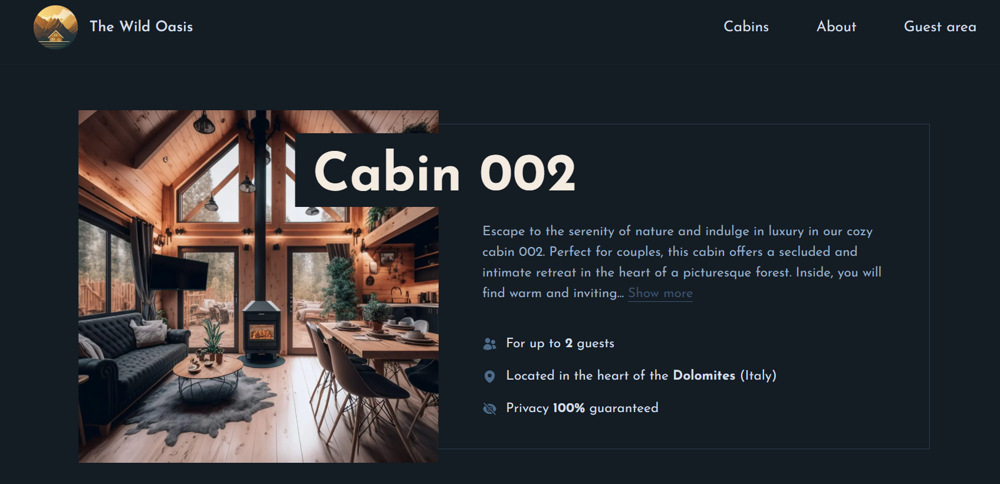

# The Wild Oasis | Hotel Reservation Platform


[](https://next-wild-osais.vercel.app/)

---

## 📚 Table of Contents

- [Features](#-features)
- [Tech Stack](#-tech-stack)
- [Screenshots](#-screenshots)
- [Getting Started](#-getting-started)
- [License](#-license)

---

## ✨ Features

- Browse detailed information about hotel cabins.
- Filter cabins by maximum guest capacity and check booking availability.
- Secure guest authentication and session management with **NextAuth.js**.
- Create, update, and delete reservations with a date range picker.
- View past and upcoming bookings with status indicators like "unconfirmed."
- Manage and update user profile to streamline check-in processes.
- Fully responsive design with **Tailwind CSS**.

---

## 🛠️ Tech Stack

- **Frontend:** Next.js, Tailwind CSS
- **Backend & Database:** Supabase
- **Authentication:** NextAuth.js
- **Version Control:** Git, GitHub

---

## 📸 Screenshots

> Create a `screenshots` folder and add your project screenshots!

### 🏨 Home Page


### 🛏️ Cabin Listings


### 📅 Booking Page



---

## 🚀 Getting Started

### Prerequisites

- Node.js installed
- Supabase account and project
- NextAuth.js configuration

### Installation

```bash
# Clone the repository
git clone https://github.com/Temitayo40/Next-wild-osais.git

# Navigate into the project directory
cd Next-wild-osais

# Install dependencies
npm install

# Set up environment variables
cp .env.example .env

# Run the application
npm run dev
